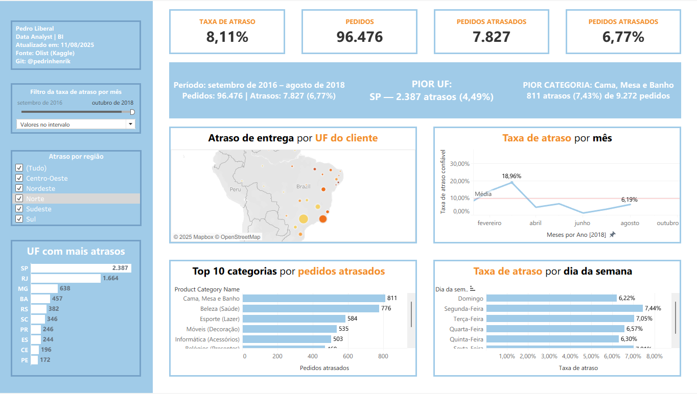
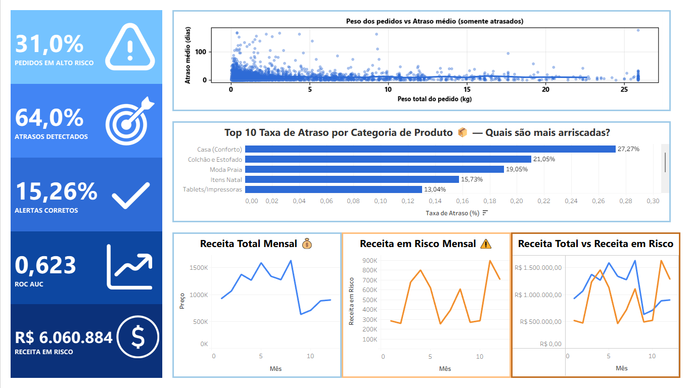

# 📊 E-Commerce 360 – Do Clique ao Lucro  

Projeto completo de análise de dados e previsão de atrasos logísticos no e-commerce brasileiro.  
Baseado no [Brazilian E-Commerce Public Dataset (Kaggle)](https://www.kaggle.com/datasets/olistbr/brazilian-ecommerce).  

---

## 🖼️ Dashboards  

### Dashboard de Atraso  
  
*Visão logística com % atrasos, tempo médio de atraso, distribuição por UF/cidade/seller e tendência temporal.*  
[🔗 Abrir no Tableau](tableau/Dashboard_Atraso.twbx)  

### Dashboard de Avaliações / NPS  
  
*Visão de satisfação do cliente com NPS, distribuição de notas, % positivas/negativas e ranking de categorias com pior avaliação.*  
[🔗 Abrir no Tableau](tableau/Dashboard_Review.twbx)  

### Dashboard de Risco Logístico  
  
*Visão integrada de risco logístico com KPIs de alto risco, atrasos detectados, performance do modelo e impacto em receita.*  
[🔗 Abrir no Tableau](tableau/Dashboard_Risco_logistico_financeiro.twb)  

---

## 🚀 Insights de Negócio  

- **Regiões Norte e Nordeste** concentram maior atraso logístico.  
- **Categorias volumosas** (móveis/eletrodomésticos) têm risco de atraso acima da média.  
- Pedidos com **prazo estimado curto + frete baixo** tendem a atrasar mais.  
- **Reduzir em 1 dia** o atraso médio em categorias críticas gera ganho potencial de NPS e receita.  
- A categoria **Seguros e Serviços** é a pior avaliada (nota média 2,5).  
- Existe uma **polarização nas avaliações**: concentração em notas 1 e 5.  
- Apesar do **NPS global positivo (62,38)**, **15% dos clientes são detratores**.  
- **31% dos pedidos** estão classificados como de **alto risco de atraso**.  
- O modelo detecta **64% dos atrasos**, mas ainda com precisão baixa (15%).  
- A **receita em risco** ultrapassa **R$ 6 milhões**, exigindo monitoramento contínuo.  

---

## 🔎 Visão Geral do Projeto  

O projeto conecta toda a jornada de dados:  
- **ETL** → ingestão dos CSVs em PostgreSQL e modelagem dimensional  
- **Métricas-chave** → atraso médio, % on time, distribuição de avaliações, RFM  
- **Machine Learning** → modelo preditivo de risco de atraso com XGBoost + SHAP  
- **Dashboards** → análises interativas no Tableau com KPIs, mapas e simulações  
- **Storytelling** → insights de negócio para logística, satisfação e receita  

---

## 📂 Estrutura do Repositório
```
ecommerce-360/
│── data/
│   ├── raw/         # dados brutos (CSV Kaggle)
│   ├── processed/   # dados tratados + predições
│── notebooks/       # análises exploratórias, EDA, ML
│── scripts/         # ETL, features, treinamento de modelo
│── docs/            # dicionário de dados, ER diagram, métricas, plots
│── models/          # modelos .pkl e scaler
│── requirements.txt
│── README.md
```
---

## ⚙️ Setup do Ambiente
```bash
git clone https://github.com/seuusuario/ecommerce-360.git
cd ecommerce-360

python -m venv .venv
.venv\Scripts\activate
pip install -r requirements.txt
```

---

## 📥 ETL e Modelagem
- Ingestão dos CSVs via Kaggle API → `data/raw`  
- Carregamento para PostgreSQL em schemas `staging_*`  
- Criação de modelo dimensional (`dwh`) com dimensões e fatos:  
  - **Dimensões**: clientes, sellers, produtos, categorias, geolocalização, datas  
  - **Fatos**: pedidos, itens, reviews, entregas  

---

## ⚙️ Scripts principais
- `scripts/load_raw_to_staging.py` → ingere dados brutos (CSV) e carrega no **staging**  
- `scripts/build_features.py` → gera e consolida **features de negócio e logísticas** (distância, prazo, peso/volume, etc.)  
- `scripts/train_delay_model_v2.py` → treina o modelo preditivo de **risco de atraso** com as features  
- `scripts/save_predicted_delay.py` → salva previsões do modelo em CSV/Parquet para consumo no Tableau  
- `scripts/recompute_metrics.py` → recalcula métricas de performance do modelo (recall, precisão, AUC)  
- `scripts/scatter_plot_peso_vs_atraso_medio.py` → gera visualização exploratória (peso × atraso médio) em PNG  

---

## 📊 Avaliação do Modelo

Durante o treinamento e validação, o modelo foi avaliado com diferentes métricas e visualizações:

- **Matriz de confusão**: análise de acertos e erros na classificação de atrasos.  
- **Curva ROC (AUC = 0.62)**: capacidade discriminativa do modelo em diferentes limiares.  
- **Curva Precision-Recall (AP = 0.13)**: avaliação do equilíbrio entre precisão e recall para a classe "Atraso".  
- **SHAP values (global e local)**: explicabilidade do modelo, mostrando impacto de variáveis como `dist_km`, `dias_previstos_entrega`, `frete_ratio` e `ticket`.  

Essas análises foram fundamentais para validar a utilidade prática do modelo e identificar os principais fatores de risco para atrasos.

---

## 🔄 Automação
- `Makefile` ou cron/GitHub Actions para rodar ETL + ML periodicamente  
- Logs padronizados com emojis ✅⚠️❌ para acompanhamento  

---

## ✅ Validação & QA
- Testes unitários de transformação (pytest)  
- Verificação de qualidade de dados (nulls, duplicatas, ranges)  
- Revisão de performance SQL (EXPLAIN ANALYZE)  

---
